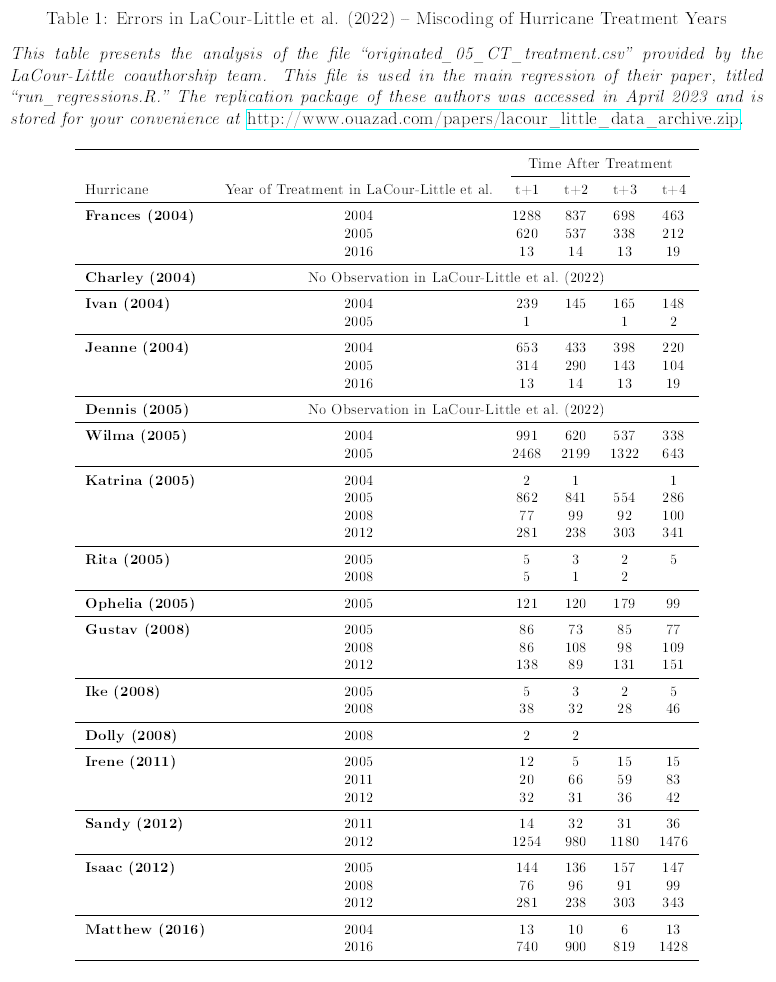

# Flaws in the independent replication, Table 8 of the comment

The LLPW (2024) comment displays a Table 8 that suggests an independent replication.

This independent replication has not been made available to the readers of the Review of Financial Studies,
but we thank AP for sharing with us a ZIP link to the data archive.

We store this archive at the URL https://www.dropbox.com/scl/fi/bsy3vho7dvvh23lwdg5zz/lacour_little_data_archive_initial_submission.zip?rlkey=tznr0xbeuelipjvalvio2hir0&st=idejl55x&dl=0 for your convenience. This is automatically downloaded by the script download_independent_replication.sh

## Miscoding of the event study design

We provide evidence that the independent replication significantly miscodes the event study design, has no observations for significant hurricanes.

The script generates the following table.

## Significant pre-trends

Table 8 of the comments shows that 11 out of 27 placebo dummies for Time -4 to Time -2 are significant. We provide F statistics that reject the null hypothesis that the pre-hurricane dummies are jointly zero. 

This is generated by the code 02_Ftests_pretrends.R

This suggests that the quasi-experimental setup is poorly designed and that the post-hurricane dummies are not interpretable. 
